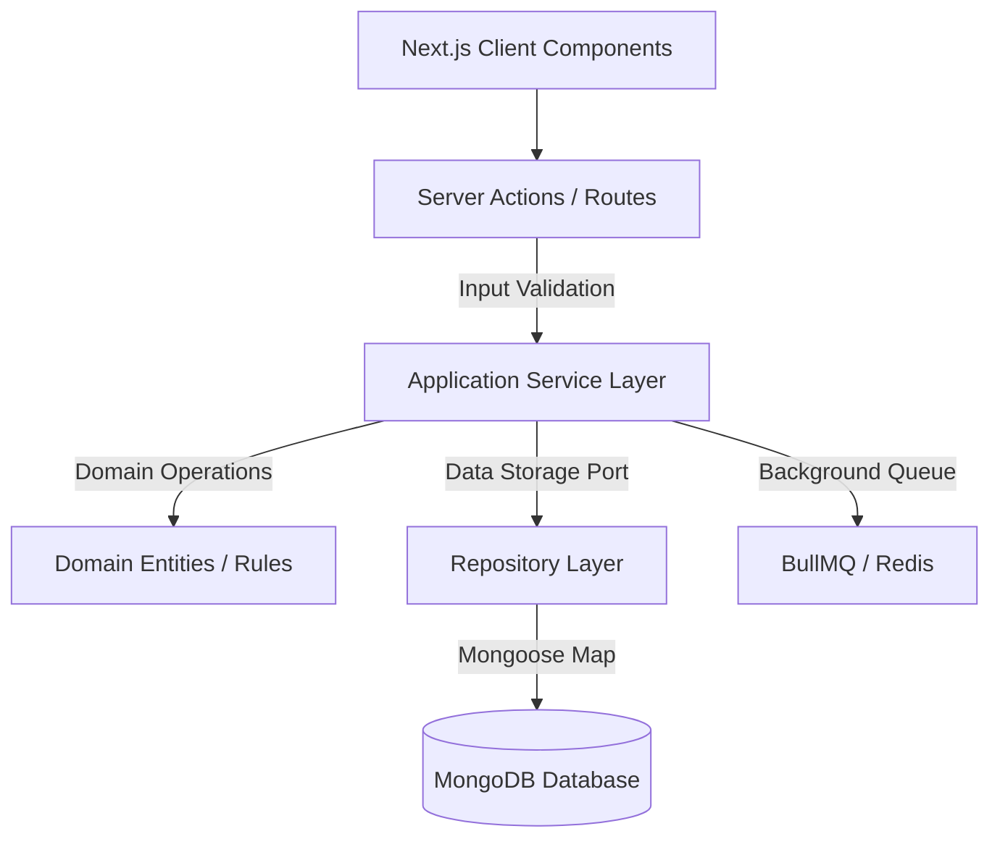

# 02 - Architecture Document

## Overview

DropshopNN enforces Domain-Driven Design (DDD) combined with a Feature-First modular file layout. The separation of concerns ensures that the core domain rules are isolated from database technologies and UI frameworks.

## Diagram

## Layers

### 1. Domain Layer (`domain/`)

- Contains entities, value objects, domain events, and repository interfaces.
- Strictly pure JavaScript/TypeScript; no database-specific dependencies (e.g., Mongoose schemas).

### 2. Service Layer (`services/`)

- Coordinates application activity.
- Executes domain rules, triggers repository data fetching, calls third-party services, and publishes background tasks.

### 3. Repository Layer (`repositories/`)

- Abstract boundary for database access.
- Implements repository interfaces using Mongoose models. Converts database records to clean Domain Entities.

### 4. Infrastructure & Presentation Layer (`actions/`, `components/`)

- Next.js Server Actions, Route Handlers, and UI.
- Validates user input using Zod before calling the service layer.
