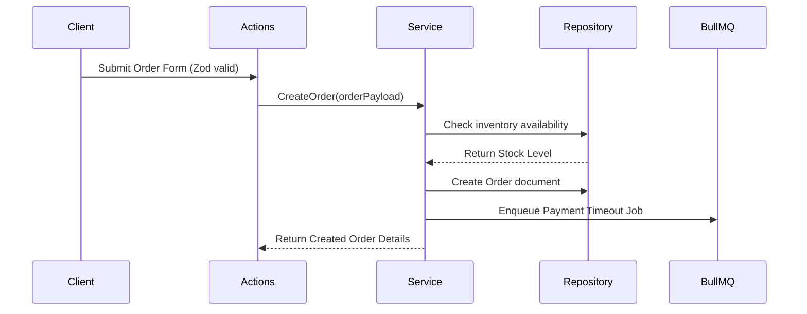

# 07 - Feature Roadmap & Flows

## Core Flows

### 1. Order Checkout

### 2. Courier Dispatcher

- Real-time courier dispatch job runs via BullMQ.
- If courier dispatch API fails, BullMQ automatically schedules a retry with exponential backoff.

### 3. Merchant Digital Wallet Ledger

- Credit/Debit transaction ledger entries are processed inside MongoDB multi-document transactions to guarantee database consistency.
