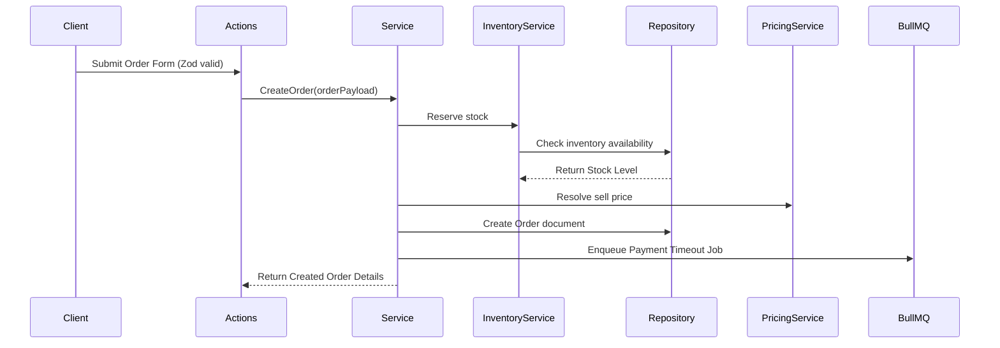
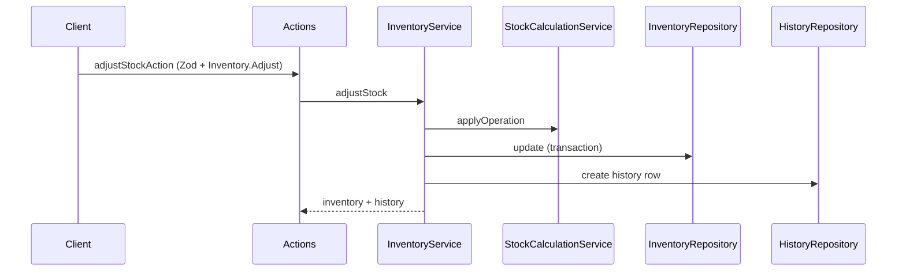
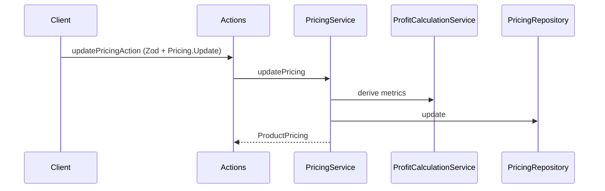
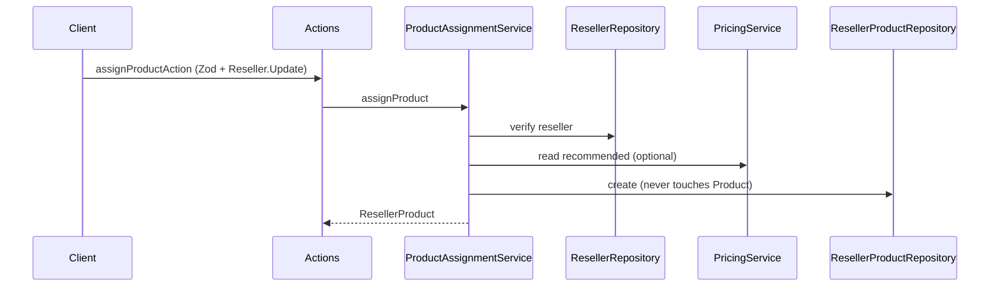

# 07 - Feature Roadmap & Flows

## Core Flows

### 1. Order Checkout (future)

### 2. Stock Adjustment (Phase 6)

### 3. Pricing Update (Phase 6)

### 4. Courier Dispatcher (future)

- Real-time courier dispatch job runs via BullMQ.
- If courier dispatch API fails, BullMQ automatically schedules a retry with exponential backoff.

### 5. Merchant Digital Wallet Ledger (future)

- Credit/Debit transaction ledger entries are processed inside MongoDB multi-document transactions to guarantee database consistency.

### 6. Reseller Product Assignment (Phase 7)

