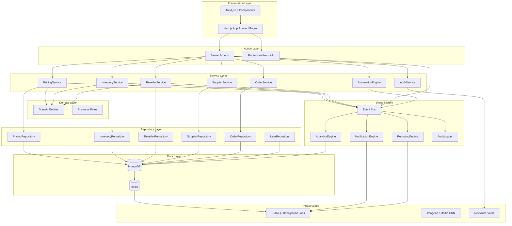

# 20 - Architecture Overview

## Platform Identity

DropshopNN is a **Bangladesh-first Commerce Operating System** that combines product catalog management, dropshipping, reselling, wholesale operations, supplier management, order management, business automation, reporting, and analytics into one unified platform.

---

## Architecture Diagram



---

## Layered Architecture

### 1. Presentation Layer

Next.js 16 App Router with React 19 Server Components. Responsible for rendering UI and handling user interactions.

### 2. Action Layer

Server Actions and Route Handlers. The entry point for all data mutations. Validates inputs with Zod before calling service layer.

### 3. Service Layer

Business logic orchestrators. Coordinate domain operations, repository calls, and event publication. Enforce all business rules.

### 4. Domain Layer

Pure TypeScript entities and value objects. No database dependencies. Business rules are expressed here.

### 5. Repository Layer

Data access abstraction. Converts between MongoDB documents and domain entities. All repositories extend `BaseRepository`.

### 6. Event System

Decoupled communication between modules using pub/sub patterns. Powers automation, analytics, notifications, reporting, and audit.

### 7. Infrastructure

Background jobs (BullMQ), file storage (ImageKit), authentication (NextAuth), caching (Redis).

---

## Module Map

| Module        | Purpose                                              | Status       |
| ------------- | ---------------------------------------------------- | ------------ |
| Auth          | Authentication, authorization, RBAC                  | ✅ Complete  |
| Supplier      | Supplier onboarding, profiles, settings              | ✅ Complete  |
| Product       | Product catalog (name, description, media, variants) | ✅ Complete  |
| Pricing       | All monetary values, margins, rules, campaigns       | ✅ Complete  |
| Inventory     | Stock buckets, history, availability, reservations   | ✅ Complete  |
| Reseller      | Reseller profiles, private catalog, pricing          | ✅ Complete  |
| Customer      | Customer profiles, addresses, history                | ⏳ Phase 8   |
| Order         | Order lifecycle, split shipments, returns            | ⏳ Phase 9   |
| Courier       | Courier integration, dispatch, tracking              | ⏳ Phase 10  |
| Payment       | Payment gateways, reconciliation, refunds            | ⏳ Phase 11  |
| Wallet        | Digital wallet, credits, payouts                     | ⏳ Phase 12  |
| Invoice       | Invoice generation, tax documents                    | ⏳ Phase 13  |
| Reports       | Report generation, scheduling, export                | 🔧 In Design |
| Analytics     | Event-driven metrics, dashboards                     | 🔧 In Design |
| Notifications | Multi-channel notification dispatch                  | 🔧 In Design |
| Automation    | Business process automation                          | 🔧 In Design |

---

## Key Design Decisions

### DDD with Feature-First Layout

Each business capability is a self-contained feature module under `src/features/<name>/`. Modules communicate through the Event Bus, not direct imports.

### Catalog → Pricing → Inventory Separation

Product holds catalog data only. Monetary values live in the Pricing module. Stock data lives in the Inventory module. This separation enables independent scaling and evolution of each concern.

### Integer Cents for Money

All monetary values are stored as integers representing the smallest currency unit. This eliminates floating-point precision issues common in financial systems.

### Strategy Pattern for Pricing

The pricing engine uses a strategy pattern to support unlimited pricing strategies. New strategies can be added without modifying existing code.

### Event-Driven Automation

Instead of services directly calling each other, they publish events. The Automation Engine coordinates all downstream effects. This decouples modules and enables independent development.

### Repository Pattern

All database access goes through repositories that convert between MongoDB documents and clean domain entities. No direct database calls in services or actions.

### Bangladesh-First

The architecture is built for Bangladesh from the ground up — BDT currency, Bengali/English languages, Bangladesh address hierarchy, Bangladesh mobile validation, and local commerce workflows.

---

## Data Flow Patterns

### Read Pattern

```
User Request → Server Component → Service → Repository → MongoDB → Domain Entity → Response
                                  ↓
                           (Cache: Redis)
```

### Write Pattern

```
User Action → Server Action → Zod Validation → Service → Repository → MongoDB
                                                       │
                                              Event Bus → Automation → Analytics → Notifications
```

### Event Flow

```
Service publishes event → Event Bus
    ├── Synchronous handlers: AuditLog, ActivityTimeline
    └── Async handlers (BullMQ): AutomationEngine, AnalyticsEngine, NotificationEngine, ReportingEngine
```

---

## Technology Stack

| Layer      | Technology                   |
| ---------- | ---------------------------- |
| Framework  | Next.js 16 (React 19)        |
| Language   | TypeScript (strict mode)     |
| Database   | MongoDB (Mongoose ODM)       |
| Cache      | Redis (ioredis)              |
| Queue      | BullMQ                       |
| Auth       | NextAuth v5 (Credentials)    |
| Media      | ImageKit CDN                 |
| Validation | Zod                          |
| Styling    | Tailwind CSS v4              |
| UI Library | shadcn/ui (Radix primitives) |
| Animation  | Framer Motion                |
| Forms      | React Hook Form              |

---

## Recommended Implementation Order

Based on the dependency map and business priority:

### Immediate Priority

1. **Event Bus** (foundation for all automation)
2. **Audit System** (foundation for tracking)
3. **Analytics Engine** (foundation for dashboards)
4. **Notification Engine** (customer communication)

### Phase 8: Customer Module

5. **Customer Module** (profiles, addresses)
6. **Shopping Cart** (persistence, guest→user merge)
7. **Checkout Flow** (address selection, inventory reservation)

### Phase 9: Order Management

8. **Order Service** (create, status, lifecycle)
9. **Return/Refund Processing**
10. **Order Dashboard** (list, detail, actions)

### Phase 10: Courier Integration

11. **Multi-Courier Abstraction Layer**
12. **SteadFast Integration**
13. **Pathao/eCourier Integration**
14. **Automated Dispatch**

### Phase 11: Payments

15. **bKash Gateway Integration**
16. **Nagad Gateway Integration**
17. **Payment Reconciliation**

### Phase 12: Wallet

18. **Digital Wallet Service**
19. **Payout Processing**
20. **Transaction Ledger**

### Phase 13: Invoicing

21. **Invoice Generator**
22. **Tax Document Templates**

### Future

23. **Multi-Warehouse Management**
24. **Supplier Comparison Engine**
25. **Advanced Analytics & BI**
26. **Multi-Tenant & International Expansion**
